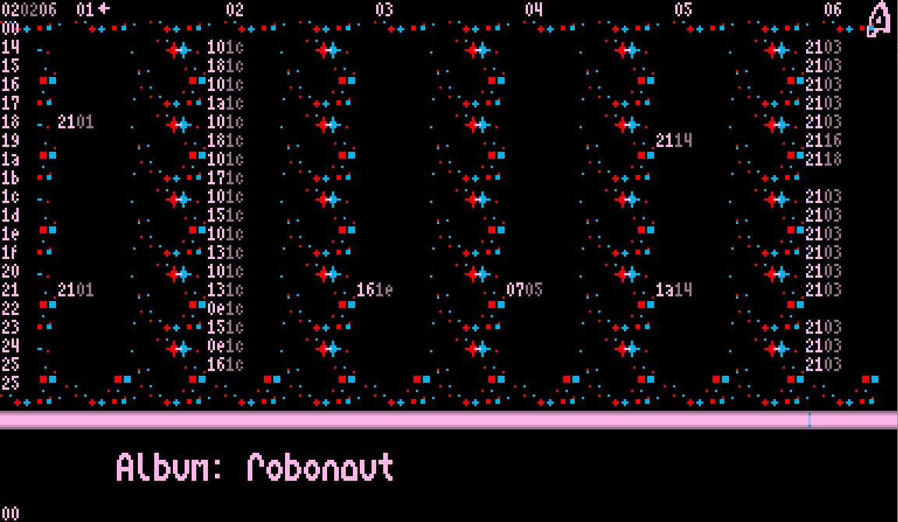

# VBeatJukebox
This extends the [VBeat](https://github.com/enthusi/VBeat) engine by an option to
store multiple songs in ROM and select them via controller.
To facilitate this, some areas of the data management and hence the code needed to be rewritten.
The core functionality and conversion from s3m are identical.
VBeatJukebox was developed for the [Tronimal - Robonaut music album](https://www.kickstarter.com/projects/tronimal/robonaut).
## Credits
- code: *Martin 'enthusi' Wendt*
- audio & composing hints: *Yogi (Tronimal)*
- 8x16 font: *Oliver 'v3to' Lindau*
## In action

## Specs
- Comes with the full source data (S3M) for 3 example songs.
- The instruments in the S3M are sampled from the actual VBeat instruments on the Virtual Boy
- All featured Instruments are free to use (give credits to Tronimal when they are due)
## Compilation
### LINUX
A simple `make` should suffice, once you prepared all input data
Alternatively you go through the steps for Windows but use WINE and DOSBOX.
### WINDOWS
Run the \
makefile_jukebox.bat, which executes:\
`ISAS32.exe -w 2  -t vbeatjukebox.asm -o audio.o`\
`ISLK32.exe audio.o -t -v -map -o audio.isx`\
After that, run the following to create the ROM image for Virtual Boy:\
`DOSBOX VUIC.EXE audio.isx audio.vb`\
Obviously, you need DOSBOX for this.\
The resulting file audio.vb runs in VirtualBoy Emulators such as mednafen, and also can be launched from
any proper ROM Cart solution for the VB.as
# Song Composition (one way of doing it)
How to setup a usable preview for your VB instruments to be used in OpenMPT: 
(or any tracker that supports s3m)\

- Make an instrument by creating .dat waveform (use py converter or edit by hand)
- Design instrument in songdata.asm as shown in the example file. 
- Write note c5 in tracker and use the instrument number you just created.
- Compile ROM and play that single note in an emulator of your choice. (I used mednafen)
- Record that single note in any audio software. (I used audacity)
- Import new sample into the tracker software and you're ready to use the new instrument.

# Song conversion
Refer to VBeat. In short:
- compose your S3M, feel free to learn by editing the provided tunes.
- convert it into proper data format: `python3 tracker2vb.py yourtune.s3m`.
- Go through the *Compilation* steps.
- Enjoy & Share the joy.

